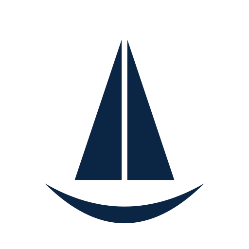
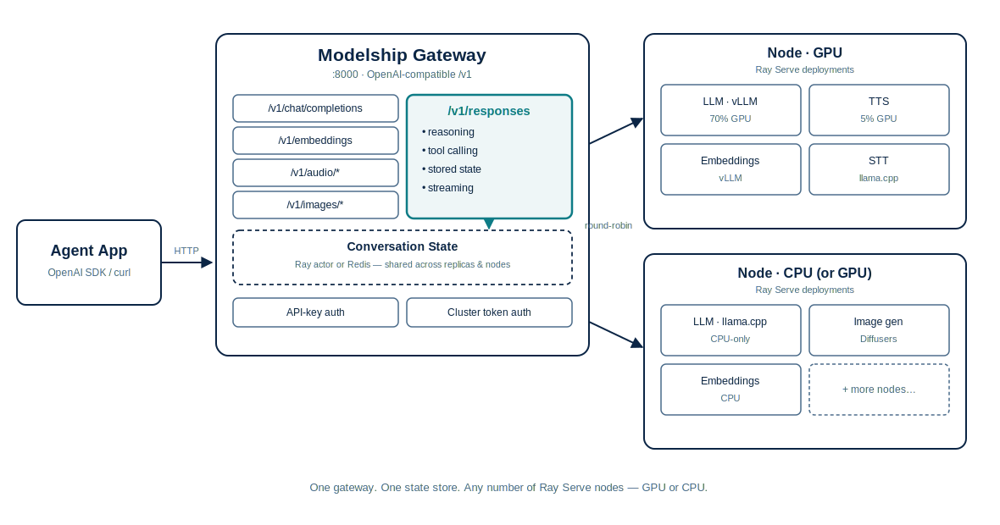

<div align="center">
  <picture>
    <source media="(prefers-color-scheme: dark)" srcset="docs/assets/logo-dark.svg">
    <source media="(prefers-color-scheme: light)" srcset="docs/assets/logo-light.svg">
    
  </picture>
</div>

# Modelship

[](https://github.com/alez007/modelship/actions/workflows/ci.yml)
[](https://opensource.org/licenses/Apache-2.0)
[](https://www.python.org/downloads/)
[](https://docs.model-ship.ai/)

Modelship runs the AI stack your agents call — chat, the **Responses API** with server-side conversation state (durable with Redis), universal **tool calling**, and **reasoning**, alongside embeddings, speech, and image generation — behind one OpenAI-compatible endpoint on your own GPUs (or CPU). Built on [Ray Serve](https://docs.ray.io/en/latest/serve/index.html): state is shared across gateway replicas, deploys are declarative, and everything is observable. Point the OpenAI SDK at it and your agent runs unchanged — private, with no per-token bill.

## Why Modelship?

- **Agent state that isn't siloed per replica** — the `/v1/responses` API with reasoning, universal tool/function calling, and server-side conversation state (`previous_response_id`) live in one pluggable store shared by every gateway replica — in-memory by default, or Redis for durability across restarts and node failure. Works across both the vLLM and llama.cpp (`llama_server`) loaders.
- **Everything an agent app calls, one endpoint** — chat, embeddings for RAG, speech-to-text, text-to-speech, and image generation, all behind a single OpenAI-compatible `/v1` surface. No juggling separate services for each modality.
- **Drop-in OpenAI, on your hardware** — any OpenAI SDK client works out of the box. Point it at Modelship instead of the OpenAI API and your agent code doesn't change — it just runs privately, on infrastructure you control.
- **GPU memory control** — allocate exact GPU fractions per model (e.g. 70% for the LLM, 5% for TTS) so a full stack fits on hardware you already own
- **Mix and match backends** — vLLM for high-throughput GPU or CPU inference, llama.cpp for efficient quantized GGUF models, Diffusers for images, and a plugin system for custom backends — in the same deployment

## Architecture

<picture>
  <source media="(prefers-color-scheme: dark)" srcset="docs/assets/architecture-dark.svg">
  <source media="(prefers-color-scheme: light)" srcset="docs/assets/architecture-light.svg">
  
</picture>

Each model runs as an isolated [Ray Serve](https://docs.ray.io/en/latest/serve/index.html) deployment with its own lifecycle, health checks, and resource budget. Four inference backends are available:

| Backend | Best for | GPU required |
|---|---|---|
| **vLLM** | High-throughput chat, embeddings, transcription | No — installs on GPU or CPU |
| **llama.cpp** (`llama_server`) | High-efficiency quantized GGUF models (chat, embeddings, vision) | No |
| **Diffusers** | Image generation | Yes |
| **Custom (plugins)** | TTS backends (Kokoro ONNX, Orpheus), STT backends (whisper.cpp) | No |

Models can be deployed across multiple GPUs, run on CPU-only, or both — multiple deployments of the same model (e.g. one on GPU via vLLM, one on CPU via vLLM or llama.cpp) are load-balanced with round-robin routing. Each deployment can also scale horizontally with `num_replicas`.

## Requirements

- **Docker** (or Python 3.12+ with `uv` for local development)
- **NVIDIA GPU** (optional) — 16 GB+ VRAM recommended for a full stack (LLM + TTS + STT + embeddings) via vLLM; 8 GB is sufficient for lighter setups. Not required when using the vLLM or llama.cpp backends on CPU
- **[NVIDIA Container Toolkit](https://docs.nvidia.com/datacenter/cloud-native/container-toolkit/install-guide.html)** — required only when running GPU models in Docker
- **HuggingFace token** for gated models

## Features

- **Multi-model, multi-GPU** — run chat, embedding, STT, TTS, and image generation models simultaneously across one or more GPUs with tunable per-model GPU memory allocation
- **CPU-only support** — run models without a GPU using the vLLM or llama.cpp (`llama_server`) backends (chat, embeddings, transcription, vision). Useful for development, testing, or small models that don't need GPU acceleration
- **Multiple inference backends** — vLLM for high-throughput GPU or CPU inference, llama.cpp for efficient quantized GGUF models on CPU or GPU, Diffusers for image generation, and a plugin system for custom backends
- **Zero-downtime hot-reloads** — modify your `models.yaml` and run a cluster reconcile; changes are applied incrementally without interrupting the API gateway or unchanged models
- **Advanced agentic capabilities** — native support for DeepSeek-style reasoning (`<think>` blocks parsed into `reasoning_content`) and universal tool/function calling across the vLLM and GGUF (`llama_server`) backends
- **Per-model isolated deployments** — each model runs in its own Ray Serve deployment with independent lifecycle, health checks, failure isolation, and configurable replica count
- **OpenAI-compatible API** — drop-in replacement for any OpenAI SDK client
- **Streaming** — SSE streaming for chat completions and TTS audio
- **Plugin system** — opt-in TTS and STT backends installed as isolated uv workspace packages
- **Multi-GPU & hybrid routing** — assign models to specific GPUs or run them on CPU-only; deploy the same model on both GPU and CPU and requests are load-balanced via round-robin; full tensor parallelism support for large models spanning multiple GPUs
- **Client disconnect detection** — cancels in-flight inference when the client disconnects, freeing GPU resources immediately
- **Security** — gateway API-key authentication (`MSHIP_API_KEYS`), Ray cluster token auth (`--ray-auth=token`), and configurable request payload/concurrency limits
- **Built-in observability** — Prometheus metrics, custom `modelship:*` metrics, vLLM engine stats, Ray cluster metrics, structured JSON logging, and OpenTelemetry log export; pre-built Grafana dashboard and alerting rules included

## Supported OpenAI Endpoints

| Endpoint | Usecase |
|---|---|
| `POST /v1/chat/completions` | Chat / text generation (streaming and non-streaming) |
| `POST /v1/responses` | Responses API — text, reasoning, client-driven tool calls, and stored conversations (streaming and non-streaming) |
| `GET`/`DELETE /v1/responses/{id}` | Fetch or drop a stored response (`/input_items` lists its input) |
| `POST /v1/embeddings` | Text embeddings |
| `POST /v1/audio/transcriptions` | Speech-to-text |
| `POST /v1/audio/translations` | Audio translation |
| `POST /v1/audio/speech` | Text-to-speech (SSE streaming or single-response) |
| `POST /v1/images/generations` | Image generation |
| `GET /v1/models` | List available models |

## Quick Start

The fastest way to try Modelship: run a tiny reasoning model on a laptop — no GPU required. Copy-paste this block and you'll have an OpenAI-compatible API on `http://localhost:8000` in a few minutes.

```bash
mkdir -p models-cache && cat > models.yaml <<'EOF'
models:
  - name: reasoning-qwen
    model: "lmstudio-community/Qwen3-0.6B-GGUF:*Q4_K_M.gguf"
    usecase: generate
    loader: llama_server
    num_cpus: 3
    llama_server_config:
      n_ctx: 4096  # Give reasoning space to think
EOF

docker run --rm --shm-size=8g \
  -v ./models.yaml:/modelship/config/models.yaml \
  -v ./models-cache:/.cache \
  -p 8000:8000 \
  ghcr.io/alez007/modelship:latest-cpu
```

Images are multi-arch (amd64 + arm64), so this works on Apple Silicon and ARM Linux hosts too.

Once the server is up (look for `Deployed app 'modelship api' successfully`), call the **Responses API** and watch the model think:

```bash
curl http://localhost:8000/v1/responses \
  -H "Content-Type: application/json" \
  -d '{
    "model": "reasoning-qwen",
    "input": "Which is larger, 9.11 or 9.9?"
  }'
```

The response includes both `output_text` and a first-class `reasoning` output item — the same server-side conversation state (`previous_response_id`) and tool-calling support work here as they do on GPU-backed models. `/v1/chat/completions` remains available too, if that's what your client speaks.

### GPU (vLLM, Diffusers)

For high-throughput GPU inference, use the `-cuda` image and add `--gpus all`. You'll also need the [NVIDIA Container Toolkit](https://docs.nvidia.com/datacenter/cloud-native/container-toolkit/install-guide.html) and an `HF_TOKEN` for gated models. Example `models.yaml` entries for vLLM, Diffusers, and multi-GPU setups live in [docs/model-configuration.md](docs/model-configuration.md); ready-to-run configs are in [config/examples/](config/examples/).

```bash
docker run --rm --shm-size=8g --gpus all \
  -e HF_TOKEN=your_token_here \
  -v ./models.yaml:/modelship/config/models.yaml \
  -v ./models-cache:/.cache \
  -p 8000:8000 \
  ghcr.io/alez007/modelship:latest-cuda
```

> [!NOTE]
> `ghcr.io/alez007/modelship:latest` (bare tag, no suffix) is the **thin** control/coordinator image — no torch/vllm, for a driver/head role only. It cannot serve models by itself; always use `-cuda` or `-cpu` to actually run inference. See [docs/development.md](docs/development.md) for the full three-image breakdown.

> [!TIP]
> Always set `--shm-size=8g` (or higher) when running the docker container to prevent PyTorch from hitting shared memory limits during multi-process operations.

Hitting an error? Check [docs/troubleshooting.md](docs/troubleshooting.md).

## Plugin Support

Modelship's TTS and STT systems are built around a plugin architecture — each backend is an opt-in package with its own isolated dependencies. Plugins ship inside this repo (`plugins/`) or can be installed from PyPI.

Built-in plugins:

- [Kokoro ONNX](plugins/kokoroonnx/README.md) — lightweight TTS via ONNX Runtime (CPU or GPU)
- [Orpheus](plugins/orpheus/README.md) — expressive TTS
- [whisper.cpp](plugins/whispercpp/README.md) — CPU-only STT via `pywhispercpp`

To enable plugins for local development, pass them as extras at sync time:

```bash
uv sync --extra kokoroonnx
uv sync --extra kokoroonnx --extra whispercpp  # multiple plugins
```

For deployment, plugins are automatically loaded from standalone Python wheels via Ray's `runtime_env` when referenced in `models.yaml`. This ensures that complex backend dependencies don't pollute the main API gateway or other deployments.

For a full guide on writing your own plugin, see [Plugin Development](docs/plugins.md).

## Documentation

Full docs are hosted at **[docs.model-ship.ai](https://docs.model-ship.ai/)**. The same source files are also browsable directly in this repo:

- [Development](docs/development.md) — dev environment setup, building, and running locally
- [Model Configuration](docs/model-configuration.md) — full `models.yaml` reference, GPU pinning, environment variables
- [Multi-node without Kubernetes](docs/multi-node-docker.md) — join VMs into one Ray cluster with plain `docker run`, no orchestrator
- [Architecture](docs/architecture.md) — system design, request lifecycle, plugin loading
- [Plugin Development](docs/plugins.md) — writing custom TTS/STT backends
- [Monitoring & Logging](docs/monitoring.md) — Prometheus metrics, Grafana dashboard, structured logging, health checks
- [Troubleshooting](docs/troubleshooting.md) — common first-run errors and fixes

## Monitoring

Modelship exposes Prometheus metrics (Ray cluster, Ray Serve, vLLM, and custom `modelship:*` metrics) through a single scrape endpoint on port 8079. Metrics are **enabled by default** — set `MSHIP_METRICS=false` to disable. A pre-built [Grafana dashboard](docs/grafana-dashboard.json) and [Prometheus alerting rules](docs/prometheus-alerts.yml) are included in the repository.

Logging supports structured JSON output (`MSHIP_LOG_FORMAT=json`) and request ID correlation across Ray actor boundaries. Logs can be shipped to a remote syslog server (`--log-target syslog://host:514`) or an OpenTelemetry collector (`--otel-endpoint http://collector:4317`). Set `MSHIP_LOG_LEVEL` to `TRACE` for full request/response payloads, or `DEBUG` for detailed diagnostics without payloads.

See [Monitoring & Logging](docs/monitoring.md) for full details.

## Production Readiness

Modelship is actively used and designed for stability in multi-tenant setups. Key guarantees include:

- **Mutex-backed deployments:** A cluster-wide deploy coordinator prevents VRAM exhaustion by ensuring models are never loaded concurrently if resources are tight.
- **Comprehensive HTTP-level tests:** The `tests/test_integration.py` suite validates chat, reasoning, tool-calling, and streaming across all loaders using real (small) models.
- **Security:** Gateway API-key auth, opt-in Ray cluster token auth, and payload/concurrency limits (`MSHIP_MAX_REQUEST_BODY_BYTES`) guard against unauthenticated or oversized requests.
- **Observability:** Deep integration with Prometheus, OpenTelemetry, and structured logging, with a pre-built Grafana dashboard and Prometheus alerting rules included.

We are currently hardening the Kubernetes/KubeRay path (a Helm chart ships in [`helm/`](helm/modelship/); GPU-aware probes and gateway-level rate-limiting are next). See the full [Production Readiness Plan](docs/production-readiness.md) for the scorecard and roadmap.

## Open Responses Conformance

`/v1/responses` is also tested against the independent [Open Responses](https://github.com/openresponses/openresponses) compliance suite (`bun run test:compliance`), which exercises the endpoint over real HTTP against a live deployment rather than mocks.

**Latest result: 17/17** (`Qwen3-VL-8B-Instruct` AWQ, vLLM, 2026-07-24), including the full WebSocket transport suite:

| Test | Category | Status |
|---|---|---|
| Basic Text Response | Core | ✅ Pass |
| Assistant Message Phase | Core | ✅ Pass |
| Response Output Phase Schema | Core | ✅ Pass |
| Streaming Response | Core | ✅ Pass |
| System Prompt | Core | ✅ Pass |
| Multi-turn Conversation | Core | ✅ Pass |
| Tool Calling | Core | ✅ Pass |
| Compaction Endpoint | `/v1/responses/compact` | ✅ Pass |
| Compaction Missing Required Model | `/v1/responses/compact` | ✅ Pass |
| Image Input | Vision | ✅ Pass |
| WebSocket Response | WebSocket | ✅ Pass |
| WebSocket Sequential Responses | WebSocket | ✅ Pass |
| WebSocket Continuation | WebSocket | ✅ Pass |
| WebSocket Store False Reconnect Recovery | WebSocket | ✅ Pass |
| WebSocket Missing Previous Response | WebSocket | ✅ Pass |
| WebSocket Failed Continuation Evicts Cache | WebSocket | ✅ Pass |
| WebSocket Compact New Chain | WebSocket | ✅ Pass |

## Contributing

See [CONTRIBUTING.md](CONTRIBUTING.md) for guidelines on setting up the dev environment, code style, and submitting pull requests.
